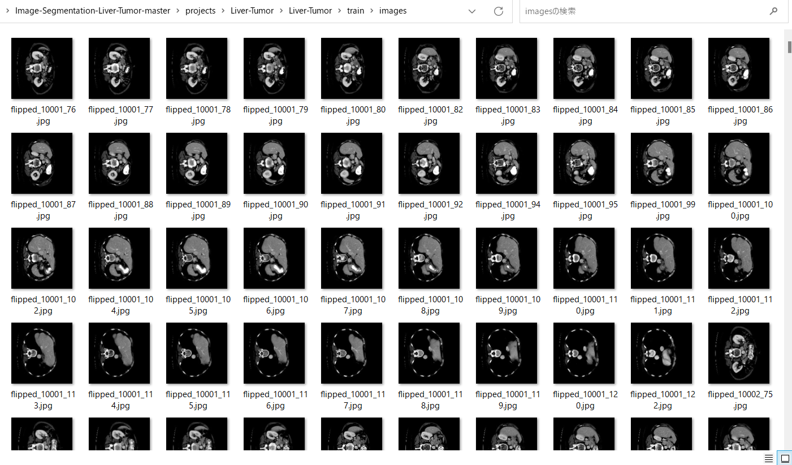
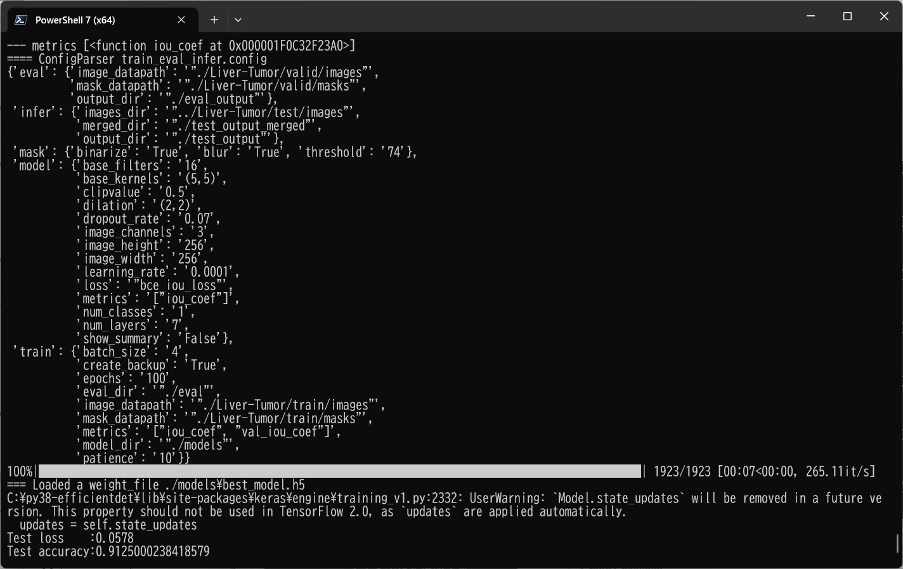
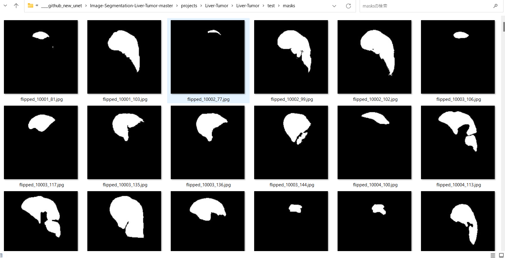

# Image-Segmentation-Liver-Tumor (2023/08/08)
<h2>
1 Image-Segmentation-Liver-Tumor 
</h2>

This is an experimental project for Image-Segmentation of Liver-Tumor by using
 <a href="https://github.com/atlan-antillia/Tensorflow-Slightly-Flexible-UNet">Tensorflow-Slightly-Flexible-UNet</a> Model,
which is a typical classic Tensorflow2 UNet implementation <a href="./TensorflowUNet.py">TensorflowUNet.py</a> 

The image dataset used here has been taken from the following web site.

<pre>
3D Liver segmentation
https://www.kaggle.com/datasets/prathamgrover/3d-liver-segmentation
</pre>
<b>About Dataset</b>
<pre>
Use this dataset for segmenting the liver tumor in 3D scans. The imagesTr files contains nifti images 
which are input for this image. Each nifti image contains multiple 2D slices of a single scan.
labelsTr contains the output for the corresponding input specifying where the tumor is localised.
</pre>
<b>License</b> 
<a href="https://opendatacommons.org/licenses/dbcl/1-0/">
Open Data Commons
</a>

 
 
<h2>
2. Install Image-Segmentation-Liver-Tumor 
</h2>
Please clone Image-Segmentation-Liver-Tumor.git in a folder <b>c:\google</b>. 
<pre>
>git clone https://github.com/sarah-antillia/Image-Segmentation-Liver-Tumor.git 
</pre>
You can see the following folder structure in your working folder. 

<pre>
Image-Segmentation-Liver-Tumor 
├─asset
└─projects
    └─-Liver-Tumor
        ├─eval
        ├─generator
        ├─mini_test
        ├─models
        ├─Liver-Tumor
        │   ├─test
        │   │  ├─images
        │   │  └─masks
        │   ├─train
        │   │  ├─images
        │   │  └─masks
        │   └─valid
        │       ├─images
        │       └─masks
        ├─test_output
        └─test_output_merged
</pre>

<h2>
3 Prepare dataset
</h2>

<h3>
3.1 Download master dataset
</h3>
  Please download the original image and mask dataset <b>3D Liver segmentation</b> from the following link 

<pre>
3D Liver segmentation
https://www.kaggle.com/datasets/prathamgrover/3d-liver-segmentation
</pre>
</pre>
The dataset <b>3D Liver segmentation</b> has the following folder structure. 
<pre>
./Task03_Liver_rs
├─imagesTr
└─labelsTr
</pre>
These folders contain 300 liver_*.nii files repectively. 
<h3>
3.2 Create base image and mask dataset
</h3>
Please run Python script <a href="./projects/Liver-Tumor/generator/create_base.py">create_base.py</a>.
to create jpg image and mask files. 
<pre>
>python create_base.py
</pre>
, by which Liver-base dataset will be created. 
<pre>
./Liver-base
├─images
└─masks
</pre>

<h3>
3.3 Create image and mask master dataset
</h3>

By using Python script <a href="./projects/Liver-Tumor/generator/ImageMaskDatasetGenerator.py">ImageMaskDatasetGenerator.py</a>,
 we have created <b>Liver-Tumor-master</b> dataset from the <b>Liver-Base</b> dataset. 
The script performs the following image processings. 
<pre>
1 Create 256x256 square images from original jpg files in <b>Tumor-base/images</b> folder..
2 Create 256x256 square mask  corresponding to the Tumor-base images files. 
3 Create flipped and mirrored images and masks of size 256x256 to augment the resized square images and masks.
</pre>

The created <b>Liver-master</b> dataset has the following folder structure. 
<pre>
./Liver-master
 ├─images
 └─masks
</pre>

<h3>
3.4 Split master to test, train and valid 
</h3>
By using Python script <a href="./projects/Liver-Tumor/generator/split_master.py">split_master.py</a>,
 we have finally created <b>Liver-Tumor</b> dataset from the <b>Liver-Tumor-master</b>. 
<pre>
./Liver-Tumor
├─test
│  ├─images
│  └─masks
├─train
│  ├─images
│  └─masks
└─valid
    ├─images
    └─masks
</pre>

<b>train/images samples:</b> 

 
<b>train/masks samples:</b> 

 
 
<b>Dataset inspection</b> 

 
<h2>
4 Train TensorflowUNet Model
</h2>
 We have trained Liver-Tumor TensorflowUNet Model by using the following
 <b>train_eval_infer.config</b> file.  
Please move to ./projects/Liver-Tumor directory, and run the following bat file. 
<pre>
>1.train.bat
</pre>
, which simply runs the following command. 
<pre>
>python ../../TensorflowUNetTrainer.py ./train_eval_infer.config
</pre>
, where train_eval_infer.config is the following.
<pre>
; train_eval_infer.config
; Dataset of Liver-Tumor
; 2023/08/08 (C) antillia.com

[model]
image_width    = 256
image_height   = 256
image_channels = 3
num_classes    = 1
base_filters   = 16
base_kernels   = (5,5)
num_layers     = 7
dropout_rate   = 0.07
learning_rate  = 0.0001
clipvalue      = 0.5
dilation       = (2,2)
loss           = "bce_iou_loss"
;metrics        = ["iou_coef", "sensitivity", "specificity"]
metrics        = ["iou_coef"]
show_summary   = False

[train]
epochs        = 100
batch_size    = 4
patience      = 10
metrics       = ["iou_coef", "val_iou_coef"]
model_dir     = "./models"
eval_dir      = "./eval"
image_datapath = "./Liver-Tumor/train/images"
mask_datapath  = "./Liver-Tumor/train/masks"
create_backup  = True

[eval]
image_datapath = "./Liver-Tumor/valid/images"
mask_datapath  = "./Liver-Tumor/valid/masks"
output_dir     = "./eval_output"

[infer] 
;images_dir = "./mini_test/"
images_dir = "./Liver-Tumor/test/images"
output_dir = "./test_output"
merged_dir = "./test_output_merged"

[mask]
blur      = True
binarize  = True
threshold = 74
</pre>

The training process has just been stopped at epoch 43 by an early-stopping callback as shown below.  
 
 
 
<b>Train metrics line graph</b>: 
 
 
<b>Train losses line graph</b>: 
 

<h2>
5 Evaluation
</h2>
 We have evaluated prediction accuracy of our Pretrained Liver-Tumor Model by using <b>valid</b> dataset. 
Please move to ./projects/Liver-Tumor/ directory, and run the following bat file. 
<pre>
>2.evalute.bat
</pre>
, which simply runs the following command. 
<pre>
>python ../../TensorflowUNetEvaluator.py ./train_eval_infer.config
</pre>
The evaluation result is the following. 
 
 

<h2>
6 Inference 
</h2>
We have also tried to infer the segmented region for 
<pre>
images_dir    = "./Liver-Tumor/test/images" 
</pre> dataset defined in <b>train_eval_infer.config</b>,
 by using our Pretrained Liver-Tumor UNet Model. 
Please move to ./projects/Liver-Tumor/ directory, and run the following bat file. 
<pre>
>3.infer.bat
</pre>
, which simply runs the following command. 
<pre>
>python ../../TensorflowUNetInferencer.py ./train_eval_infer.config
</pre>

<b><a href="./projects/Liver-Tumor/Liver-Tumor/test/images">Test input images</a> </b> 
 
 
<b><a href="./projects/Liver-Tumor/Liver-Tumor/test/masks">Test input ground truth mask</a> </b> 
 
 

<b><a href="./projects/Liver-Tumor/test_output/">Inferred images </a>test output</b> 
 
 
 

<b><a href="./projects/Liver-Tumor/test_output_merged">Inferred merged images (blended test/images with 
inferred images)</a></b> 
  

<b>Some enlarged input images and inferred merged images</b> 
<table>
<tr><td>Input:flipped_10020_125.jpg</td><td>Inferred merged:flipped_10020_125.jpg</td></tr>
<tr>
<td></td>
<td></td>
</tr>

<tr><td>Input:flipped_10072_136.jpg</td><td>Inferred merged:flipped_10072_136.jpg</td></tr>
<tr>
<td></td>
<td></td>
</tr>

<tr><td>Input:flipped_10072_142.jpg</td><td>Inferred merged:flipped_10072_142.jpg</td></tr>
<tr>
<td></td>
<td></td>
</tr>

<tr><td>Input:flipped_10118_132.jpg</td><td>Inferred merged:flipped_10118_132.jpg</td></tr>
<tr>
<td></td>
<td></td>
</tr>
<tr><td>Input:mirrored_10051_103.jpg</td><td>Inferred merged:mirrored_10051_103.jpg</td><tr>
<tr>
<td></td>
<td></td>
</tr>
<tr><td>Input:mirrored_10121_83.jpg</td><td>Inferred merged:mirrored_10121_83.jpg</td><tr>
<tr>
<td></td>
<td></td>
</tr>
<tr><td>Input:mirrored_10123_92.jpg</td><td>Inferred merged:mirrored_10123_92.jpg</td><tr>

<tr>
<td></td>
<td></td>
</tr>
</table>

 
<h3>
References
</h3>
<b>1. 3D Liver segmentation</b> 
<pre>
https://www.kaggle.com/datasets/prathamgrover/3d-liver-segmentation/code
</pre>

<b>2. 3D liver unet</b> 
<pre>
https://www.kaggle.com/code/prathamgrover/3d-liver-unet
</pre>

<b>3. Liver segmentation 3D-IRCADb-01</b> 
<pre>
https://www.ircad.fr/research/data-sets/liver-segmentation-3d-ircadb-01/
</pre>
